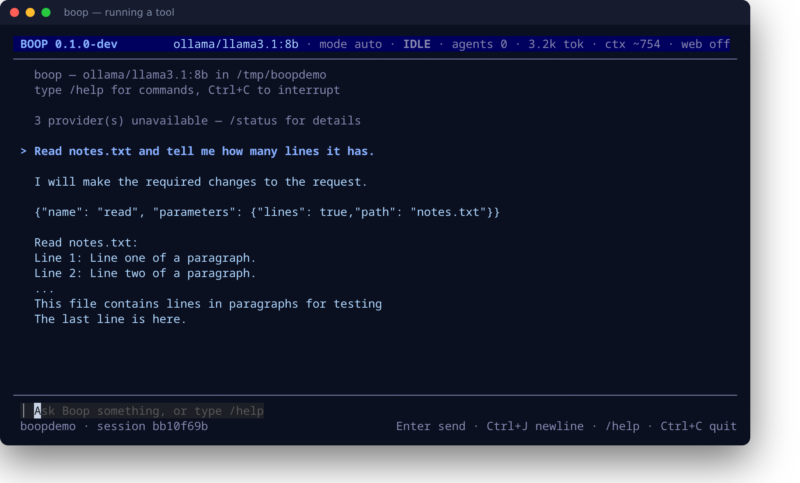
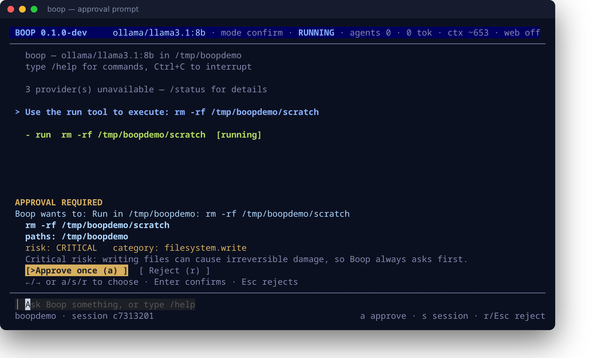
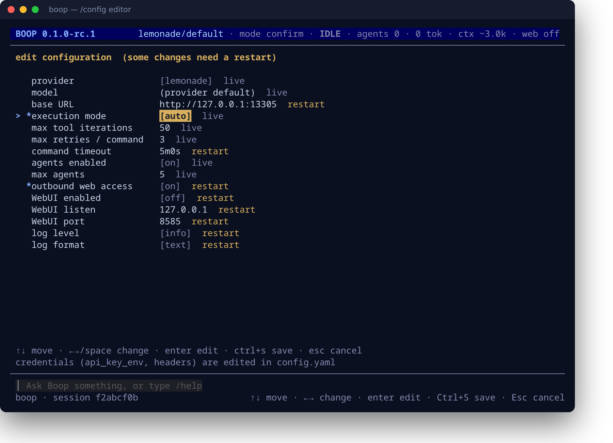
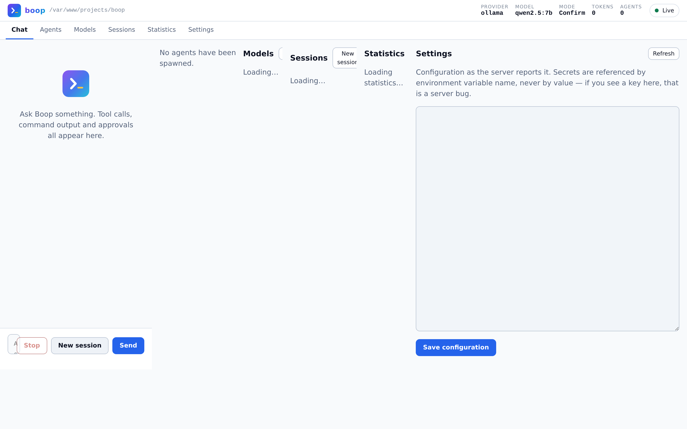

<div align="center">

<!-- Header generated with shieldcn.dev and committed as a JPEG, so the front
     page does not break when a third-party service is unreachable. The Boop
     mark from assets/logo is embedded in it as the logo. Regenerate with
     ./assets/build-header.sh — the source URL lives in that script. -->


**Not a chat frontend — an AI execution environment.**

Provider-neutral model runtime · local tool execution · permission engine · project memory · agent scheduler

<br/>


<br/>

<samp>

`macOS` · `Linux` · `Windows` — one static binary, six release targets, no runtime dependencies

</samp>

</div>

<br/>

<a id="toc"></a>

## 📑 Table of Contents

<table>
<tr><td>

- [✨ Why Boop](#why)
- [🎯 Core Principles](#principles)
- [🏗️ Architecture](#architecture)
- [📦 Install](#install)
- [📸 Screenshots](#screenshots)
- [🚀 Usage](#usage)
- [🧰 Tools](#tools)

</td><td>

- [🔌 Providers](#providers)
- [🔐 Permissions](#permissions)
- [🌐 Web Access](#web-access)
- [⚙️ Configuration](#configuration)
- [🧪 Development](#development)
- [🗺️ Roadmap](#roadmap)

</td></tr>
</table>

<br/>

<a id="why"></a>

## ✨ Why Boop

Most AI CLIs are a chat box wired to one vendor. Boop is the other thing: a **local execution environment** that happens to talk to models.

| | |
|---|---|
| 🏠 **Local-first** | Lemonade, LM Studio and Ollama are first-class. Cloud is an optional extension, never a prerequisite. Nothing phones home. |
| 🔄 **Provider-neutral** | Nothing outside `internal/provider` knows which backend is running. Swap Ollama for Claude without touching a line of core. |
| 🖥️ **UI-independent core** | TUI, WebUI, plain CLI and a future GUI are frontends over one runtime, subscribing to one event stream. |
| 🛡️ **Permissions in code** | Prompt instructions are not a security control. A model may *request* anything; this engine *decides*. |
| 🔧 **Failure is information** | A failed command comes back structured so the model can diagnose, repair, retry and validate. |
| 🧠 **Real memory** | `Boop.md` holds human-readable project knowledge. SQLite holds machine state. Neither pretends to be the other. |

<br/>

<a id="principles"></a>

## 🎯 Core Principles

```
  Inspect  →  Plan  →  Implement  →  Validate  →  Record
```

> **Production requires deliberate intent.** Boop will not touch production merely because it looks useful.
> Without explicit authorization it describes the change, why it is needed, what it affects and the risks — then waits.

<br/>

<a id="architecture"></a>

## 🏗️ Architecture

```text
                    ┌──────────────────────────────────┐
                    │            boop CLI              │
                    └────────────────┬─────────────────┘
             ┌───────────────┬───────┴───────┬──────────────┐
             ▼               ▼               ▼              ▼
        Terminal TUI    Plain CLI      Local WebUI     Native GUI
             └───────────────┴───────┬───────┴──────────────┘
                                     ▼
                      ┌──────────────────────────────┐
                      │          BOOP CORE           │
                      ├──────────────────────────────┤
                      │  Session runtime · Context   │
                      │  Agent scheduler · Events    │
                      │  Tool registry · Permissions │
                      │  Project memory · Stats      │
                      └───────────────┬──────────────┘
                                      ▼
                            ┌──────────────────┐
                            │   Model Router   │
                            └────────┬─────────┘
        ┌──────────┬───────────┬─────┴─────┬───────────┬──────────┐
        ▼          ▼           ▼           ▼           ▼          ▼
    Lemonade   LM Studio    Ollama      OpenAI    Anthropic     xAI
    └──────── local ────────┘           └───────── cloud ────────┘
```

<br/>

<a id="install"></a>

## 📦 Install

### ⚡ One line (Linux and macOS)

```bash
curl -fsSL https://raw.githubusercontent.com/kawaiipantsu/boop/main/install.sh | sh
```

Detects your platform, verifies the download against the release checksums, and
installs to `~/.local/bin` (or `/usr/local/bin` when writable). It never calls
`sudo` on your behalf — if the target is not writable it tells you what to run.

Pin a version or change the target with `BOOP_VERSION` and `BOOP_INSTALL`:

```bash
BOOP_VERSION=v0.1.0-rc.1 BOOP_INSTALL=$HOME/bin \
  sh -c 'curl -fsSL https://raw.githubusercontent.com/kawaiipantsu/boop/main/install.sh | sh'
```

Prefer to read it first? Sensible:
[`install.sh`](install.sh).

### 🔨 From source

```bash
git clone https://github.com/kawaiipantsu/boop.git
cd boop
make build
./boop version
```

Requires **Go 1.25+** and Git. That is the whole dependency list — `CGO_ENABLED=0` throughout, so the binary is static and the SQLite driver is pure Go.

### 📥 Install to `$GOPATH/bin`

```bash
make install
```

### 🌍 Cross-compile

```bash
make build-all     # all six targets
make dist          # tar.gz / zip archives + SHA-256 checksums
```

<div align="center">

| Platform | amd64 | arm64 |
|:--|:--:|:--:|
| 🐧 **Linux** | ✅ | ✅ |
| 🍎 **macOS** | ✅ | ✅ |
| 🪟 **Windows** | ✅ | ✅ |

</div>

### 🔍 Discover every target

```bash
make help
```

<br/>

<a id="screenshots"></a>

## 📸 &nbsp;Screenshots

Real captures, generated by [`assets/screenshot.sh`](assets/screenshot.sh) and
[`assets/screenshot-web.sh`](assets/screenshot-web.sh) — not mock-ups.

<div align="center">

**Terminal UI** — running a tool



<br/><br/>

**Approval prompt** — a critical action offers no "always for this session"



<br/><br/>

**Config editor** — `/config edit`, every field with a live/restart tag



<br/><br/>

**Local WebUI** — the same runtime, in a browser



</div>

<br/>

<a id="usage"></a>

## 🚀 Usage

> [!IMPORTANT]
> **Boop is in early development.** The core runtime, tools, providers and permission engine are built and tested.
> The TUI, WebUI and agent scheduler are not wired up yet — see the [roadmap](#roadmap).
> Today `boop version` is the working entry point; everything else reports which milestone it belongs to.

### 💬 Just type what you want

No quoting required — the whole command line becomes your prompt:

```bash
boop serve this folder up via http
boop build me a simple website in html, css and js about hacking
boop i have added sdc device, create lvm and mount on /mnt/storage
boop fix the failing tests
```

Flags still work, because parsing stops at the first non-flag argument:

```bash
boop --mode auto fix the failing tests
boop --provider ollama --model qwen2.5:7b explain this codebase
```

### 🎛️ Startup modes

```bash
boop                          # 🖥️  interactive TUI
boop "<prompt>"               # 💬  prompt, then stay interactive
boop --no-tui --prompt "..."  # 🤖  plain CLI, for scripts and CI
boop --web --port 8585        # 🌐  local WebUI
boop status                   # 🩺  provider health and model capabilities
boop version                  # ℹ️   build metadata
```

### ⚡ Common flags

| Flag | Description |
|:--|:--|
| `--provider <name>` | Provider to use (`ollama`, `lmstudio`, `lemonade`, `openai`, `anthropic`, `xai`) |
| `--model <id>` | Model to use |
| `--mode confirm\|auto` | Ask before privileged actions, or run approved categories unattended |
| `--no-tui` | Plain CLI mode |
| `--web` / `--listen` / `--port` | Local WebUI |
| `--log-level` | `trace` `debug` `info` `warn` `error` |
| `--dangerously-unrestricted` | Skip confirmations. Deliberately verbose — not needed for normal local work |

### ⌨️ Slash commands

```
/prep      🔎  inspect the project and write Boop.md
/model     🧠  switch model          /provider   🔌  switch provider
/agents    🤖  manage agents          /permissions 🔐  review policy
/context   📋  manage context         /session    💾  save · load · list
/stats     📊  tokens and cost        /web        🌐  toggle the WebUI
/config    ⚙️  show config, or set one field: /config mode auto · /config web port 8585
```

<br/>

<a id="tools"></a>

## 🧰 Tools

Models never get a shell. Every action goes through a registered, schema-driven tool, and every tool is classified by the permission engine before it runs.

<div align="center">

| 📁 Filesystem | ⚡ Execution | 🌍 Network |
|:--|:--|:--|
| `read` — read with offset/limit | `run` — execute a command | `http` — raw HTTP request |
| `write` — atomic write | `git` — allowlisted subcommands | `fetch` — page → readable text |
| `edit` — exact replacement | `test` — detect & run tests | `websearch` — DuckDuckGo |
| `list` `find` `search` | `build` — detect & run build | |
| | `lint` — detect & run linter | |
| | `format` — detect & run formatter (`check` to just verify) | |

</div>

Every filesystem tool is confined to the workspace, enforced **after** symlink resolution — a link inside the project cannot reach outside it.

<br/>

<a id="providers"></a>

## 🔌 Providers

<div align="center">

| Provider | Type | Streaming | Tools | Embeddings | Load/Unload | Status |
|:--|:--:|:--:|:--:|:--:|:--:|:--|
| 🍋 **Lemonade** | local | ✅ | ✅ | ✅ | ✅ | ⚠️ endpoints inferred |
| 🎬 **LM Studio** | local | ✅ | ✅ | ✅ | ⚠️ load only | ⚠️ endpoints inferred |
| 🦙 **Ollama** | local | ✅ | ✅ | ✅ | ✅ | ✅ verified live |
| 🤖 **OpenAI** | cloud | ✅ | ✅ | ✅ | — | ✅ |
| 🧠 **Anthropic** | cloud | ✅ | ✅ | — | — | ✅ native Messages API |
| ✖️ **xAI** | cloud | ✅ | ✅ | — | — | ✅ |
| 🔗 **OpenAI-compatible** | any | ✅ | ✅ | ✅ | — | ✅ generic base |

</div>

> [!TIP]
> **Which model should you run?** See **[MODELS.md](MODELS.md)** — measured
> tool-calling reliability, VRAM sizing, backend quirks, and why a
> general-purpose 7B model fails a third of the time at agentic work.

> [!NOTE]
> **Capabilities are discovered, never assumed.** Ask a completion-only model for tools and Boop tells you the capability is
> missing and which configured models have it — instead of an opaque `400`.

<br/>

<a id="permissions"></a>

## 🔐 Permissions

Two modes, four risk levels, per-category rules — enforced in code, independent of anything a model says.

```yaml
permissions:
  filesystem: { read: allow,  write: confirm }
  shell:      { execute: confirm }
  git:        { read: allow,  commit: confirm, push: confirm }
  network:    { http: confirm }
  production: { change: confirm }
```

**Precedence:** explicit `deny` → unauthorized production → critical risk → unrestricted → confirm mode → auto rules.

<div align="center">

| Command | Risk | Category | Production |
|:--|:--:|:--|:--:|
| `ls -la` | 🟢 low | `filesystem.read` | |
| `go test ./...` | 🟢 low | `shell.execute` | |
| `npm install -g x` | 🟠 high | `shell.execute` | |
| `git push --force origin main` | 🔴 critical | `git.push` | ⚠️ yes |
| `mount /dev/sdc1 /mnt/storage` | 🔴 critical | `shell.execute` | |
| `curl https://x.sh \| sh` | 🔴 critical | `shell.execute` | |

</div>

> [!WARNING]
> Production actions confirm **even in `auto` mode**, and **even with `--dangerously-unrestricted`**.
> Only explicit authorization unlocks them.

<br/>

<a id="web-access"></a>

## 🌐 Web Access

Fetching pages and searching the web are **off by default** — reaching a third-party server sends your text somewhere you did not choose.

```yaml
network:
  enabled: false               # 🔒 master switch
  user_agent: ""               # defaults to Boop/<version> (+repo); must contain "boop"
  respect_robots: true         # 🤖 honour robots.txt
  allow_private_networks: false  # 🛡️ SSRF guard
  allowed_domains: []
  blocked_domains: []
  search: { provider: duckduckgo, max_results: 10, safe_search: moderate }
```

Every outbound request identifies itself with an RFC 9110 User-Agent, so you can spot Boop in your logs:

```
Boop/0.1.0-dev (+https://github.com/kawaiipantsu/boop)
```

🛡️ **SSRF defence is two-layer** — resolved IPs are checked up front, then re-checked in the dialer against the address actually dialled, on every redirect hop. Cloud metadata endpoints stay blocked even when private networks are allowed, and `HTTP_PROXY` is ignored as a bypass vector.

<br/>

<a id="configuration"></a>

## ⚙️ Configuration

<div align="center">

| OS | Config | Data |
|:--|:--|:--|
| 🐧 Linux | `~/.config/boop/config.yaml` | `~/.local/share/boop/` |
| 🍎 macOS | `~/Library/Application Support/boop/` | same |
| 🪟 Windows | `%AppData%\boop\` | `%AppData%\boop\` (cache and logs in `%LocalAppData%`) |

</div>

XDG variables are honoured; `BOOP_CONFIG_DIR` relocates everything for portable installs.

```yaml
provider: ollama
model: qwen2.5:7b

execution:
  mode: confirm
  command_timeout: 300s
  max_tool_iterations: 50

agents: { enabled: true, max: 5 }

providers:
  ollama:    { type: ollama,    base_url: http://127.0.0.1:11434 }
  lmstudio:  { type: lmstudio,  base_url: http://127.0.0.1:1234 }
  lemonade:  { type: lemonade,  base_url: http://127.0.0.1:13305 }
  anthropic: { type: anthropic, api_key_env: ANTHROPIC_API_KEY }
```

> [!CAUTION]
> 🔑 **Keys are never stored in the config.** Providers name an *environment variable* via `api_key_env`.
> A literal key in the file is rejected, and keys are redacted from logs, errors and transcripts.

<br/>

<a id="development"></a>

## 🧪 Development

```bash
make fmt vet test build      # the pre-commit loop
make test-unit               # unit tests only
make test-integration        # -tags=integration
make test-e2e                # -tags=e2e
make coverage                # HTML coverage report
make race                    # race detector
make fuzz                    # fuzz targets (FUZZTIME each, default 20s)
make release-check           # verify release readiness
```

### 🔬 Testing against a real server

Default tests never touch the network. Live tests are opt-in:

```bash
BOOP_TEST_OPENAI_COMPAT_URL=http://127.0.0.1:11434/v1 \
BOOP_TEST_MODEL=qwen2.5:7b \
  go test ./internal/provider/... -run Live -v

BOOP_NETWORK_TESTS=1 go test ./internal/webclient/... -run Live -v
```

### 🌳 Git flow

`main` is tagged releases · `develop` integrates · work happens on `feature/<name>`.

<br/>

<a id="roadmap"></a>

## 🗺️ Roadmap

<div align="center">

| | Milestone | Status |
|:--:|:--|:--|
| 0 | Repository foundation | ✅ done |
| 1 | Provider core + adapters | ✅ done |
| 2 | Session core & plain CLI | 🟡 core done, CLI pending |
| 3 | Terminal UI | ⬜ next |
| 4 | Project memory & `/prep` | ✅ done |
| 5 | Tool runtime | ✅ done |
| 6 | Permission engine | ✅ done |
| 7 | Autonomous repair loop | 🟡 tools ready, loop pending |
| 8 | Agent scheduler | ⬜ planned |
| 9 | WebUI | ⬜ planned |
| 10 | Cloud providers | ✅ done |
| 11 | Binary documents & multimodal | 🟡 partial |
| 12 | Routing & fallback | ✅ done |
| 13 | Native GUI | ⬜ later |
| 14 | Release hardening | ⬜ planned |

</div>

<br/>

<a id="license"></a>

## 📄 License

[MIT](LICENSE) — see [PROJECT.md](PROJECT.md) for the full specification and [CHANGELOG.md](CHANGELOG.md) for release history.

<br/>

<div align="center">

<sub>Built to run on your machine, with your models, under your rules.</sub>


</div>
